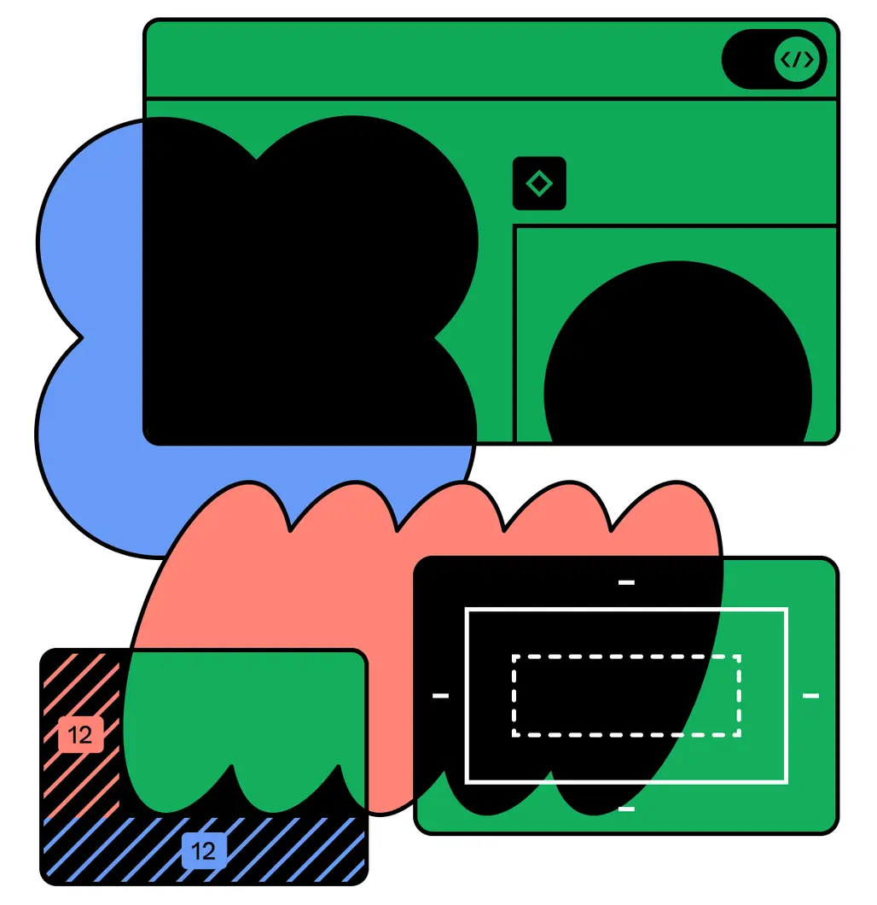

<!--
paginate: true
backgroundColor: white
_backgroundColor: #a259ff
_color: white
_class: center
-->

# Figmaでナイト

***Figmaからフロントエンド実装までの道のり***

2024年7月12日

株式会社R&D

--- 

<!--
_backgroundColor: #1abcfe
_color: white
-->

## 目次

1. Why Figma?
2. Hello, Design System!
3. どうやってFigmaとReactを繋げるの？
4. デザインシステムとフロントエンドの将来

---

## 1. Why Figma?

1. Figmaとは何か
2. なぜFigmaなのか
3. Figma活用術

---

## 1-1. Figmaとは何か

Figmaはデザインツールの一つ。
ブラウザ上で動作すること、インターネット上での同時編集が可能であることが特徴の一つ。

---

## 1-2. なぜFigmaなのか

Figmaはデザインツールの一つ。
ブラウザ上で動作すること、インターネット上での同時編集が可能であることが特徴の一つ。

---

## 1-3. Figma活用術

Figmaはデザインツールの一つ。
ブラウザ上で動作すること、インターネット上での同時編集が可能であることが特徴の一つ。

---

<!--
_backgroundColor: white
-->

## 2. Hello, Design System!

1. Design Systemの一般論
2. Figmaの文脈でDesign Systemを表現

---

<!--
_backgroundColor: white
-->

## 2-1. Design Systemの一般論

Figmaはデザインツールの一つ。
ブラウザ上で動作すること、インターネット上での同時編集が可能であることが特徴の一つ。

---

<!--
_backgroundColor: white
-->

## 2-2. Figmaの文脈でDesign Systemを表現

Figmaはデザインツールの一つ。
ブラウザ上で動作すること、インターネット上での同時編集が可能であることが特徴の一つ。

---

<!--
_backgroundColor: white
-->

## 3. どうやってFigmaとReactを繋げるの？

1. Figmaからdesign tokenをexportする
2. design tokenを開発に取り入れる方法論
3. いざ実装

---

<!--
_backgroundColor: white
-->

## 3-1. Figmaからdesign tokenをexportする

Figmaはデザインツールの一つ。
ブラウザ上で動作すること、インターネット上での同時編集が可能であることが特徴の一つ。

---

<!--
_backgroundColor: white
-->

## 3-2. design tokenを開発に取り入れる方法論

Figmaはデザインツールの一つ。
ブラウザ上で動作すること、インターネット上での同時編集が可能であることが特徴の一つ。

---

<!--
_backgroundColor: white
-->

## 3-3. いざ実装

Figmaはデザインツールの一つ。
ブラウザ上で動作すること、インターネット上での同時編集が可能であることが特徴の一つ。

---

<!--
_backgroundColor: white
-->

## 4. デザインシステムとフロントエンドの将来

1. CSS in JSとの連携
2. Figmaからcomponentを出力する

---

<!--
_backgroundColor: white
-->

## 3-1. CSS in JSとの連携

Figmaはデザインツールの一つ。
ブラウザ上で動作すること、インターネット上での同時編集が可能であることが特徴の一つ。

---

<!--
_backgroundColor: white
-->

## 3-2. Figmaからcomponentを出力する

Figmaはデザインツールの一つ。
ブラウザ上で動作すること、インターネット上での同時編集が可能であることが特徴の一つ。

---

## 6. 参考文献　

- hello
